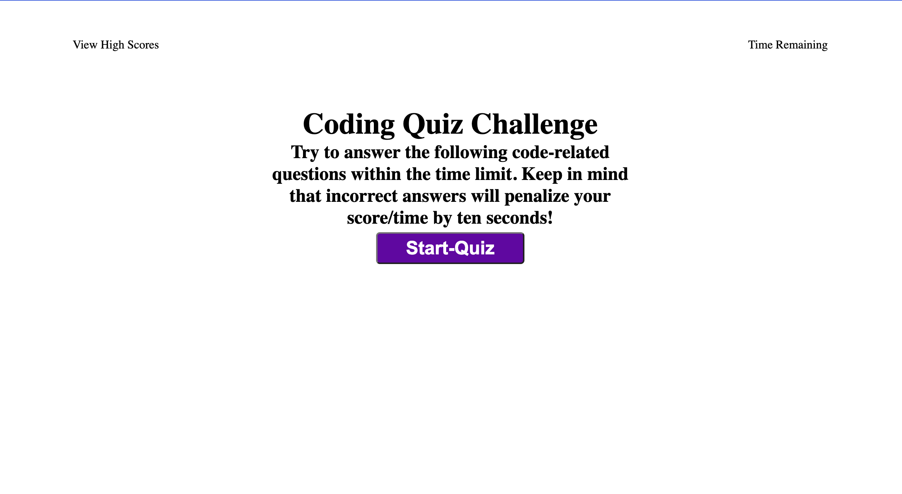
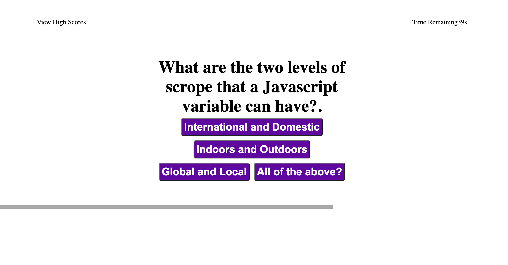
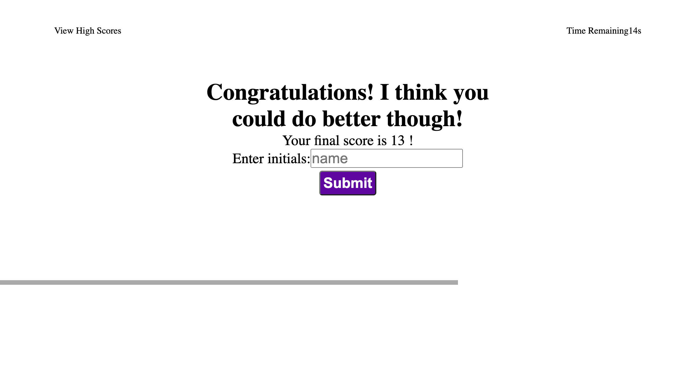

# <Javascript Quiz>

## Description

This is an online multiple choice quiz about Javascript. There is a bare minimum of HTML and CSS to provide some structure and style. The entirety of the actual use of the application is through Javascript. This was a challenging project for me and through it I have learned a great deal. The quiz is made a slightly competitive fashion and you are given a score upon completion. The score is the time remaining when you have answered all of the questions. If a question is answered incorrectly ten seconds are subtracted from the time

### AS AN employer with access to sensitive data*
* I WANT to randomly generate a password that meets certain criteria
SO THAT I can create a strong password that provides greater security

## Problems Solve

This application provides Javascript beginners an opportunity to test their knowledge of the language. The acceptanec criteria that the website completes are as follows:

* GIVEN I am taking a code quiz
* WHEN I click the start button
* THEN a timer starts and I am presented with a question
* WHEN I answer a question
* THEN I am presented with another question
* WHEN I answer a question incorrectly
* THEN time is subtracted from the clock
* WHEN all questions are answered or the timer reaches 0
* THEN the game is over
* WHEN the game is over
* THEN I can save my initials and score

## Usage

The following images show the completed website. You can visit the site by clicking [here.]()

## Installation

N/A

## License

MIT